# BÀI TẬP LÝ THUYẾT BUỔI 7 - KẾT QUẢ THỰC HIỆN
**Sinh viên:** Nguyễn Phạm Bảo Khanh  
**Mã sinh viên:** 6451071033

Dưới đây là kết quả thực hiện các bài tập trong Buổi 7.

---

## Bài 1: Danh sách người dùng (Users List)
Hiển thị danh sách các người dùng được lấy từ API.
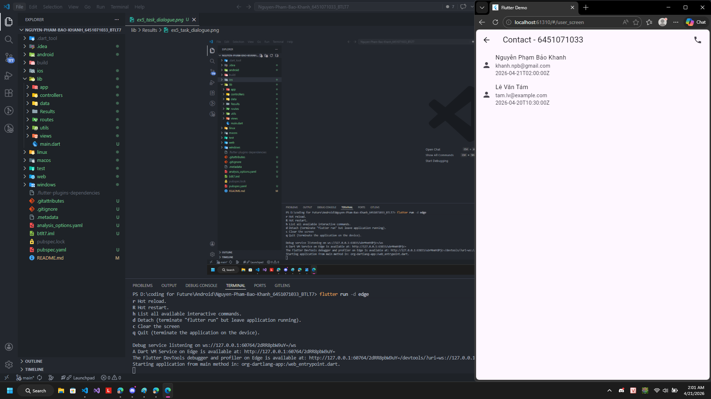

---

## Bài 2: Chi tiết sản phẩm (Product Detail)
Hiển thị thông tin chi tiết của một sản phẩm khi nhấn vào từ danh sách.
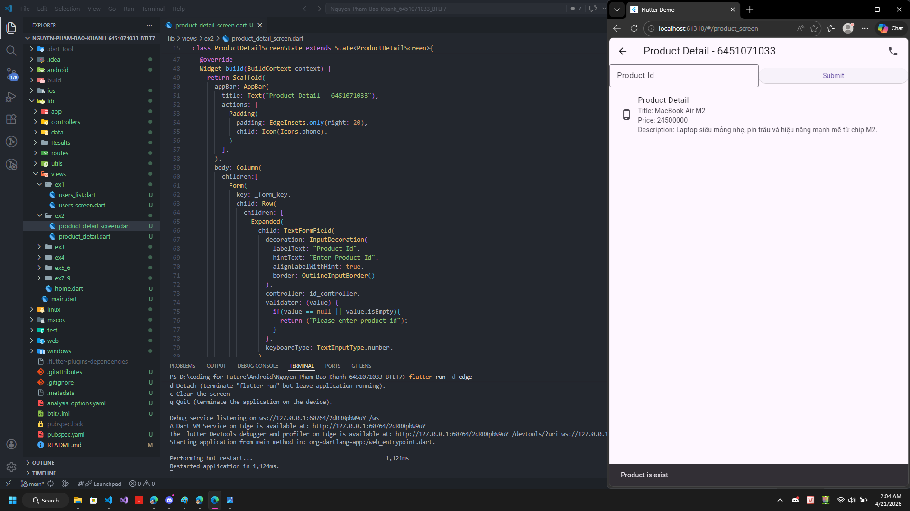

---

## Bài 3: Quản lý bài đăng (Post Management)
Thực hiện tạo mới bài đăng và kiểm tra trạng thái thành công.

| Tạo bài đăng mới | Đăng bài thành công |
|:---:|:---:|
| 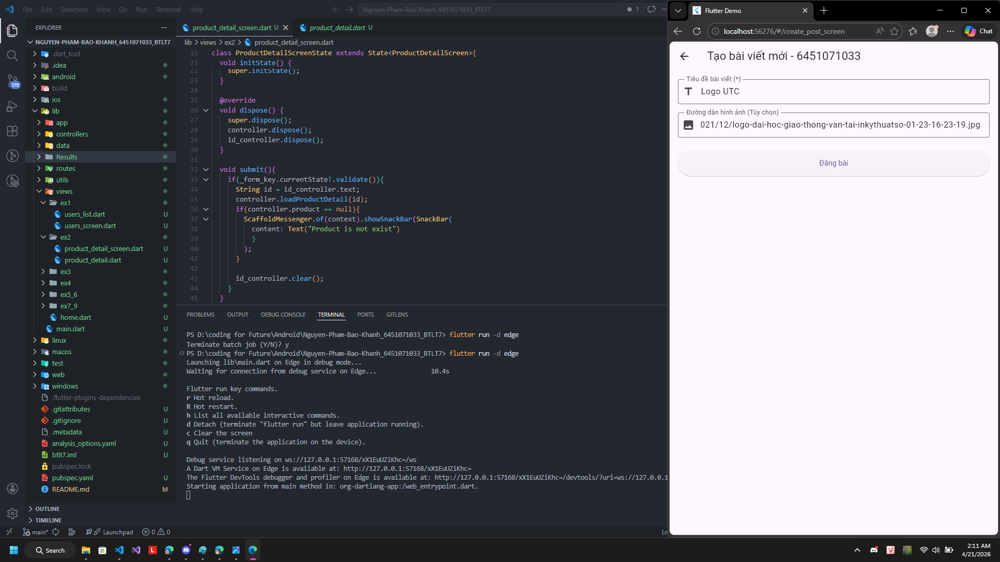 | 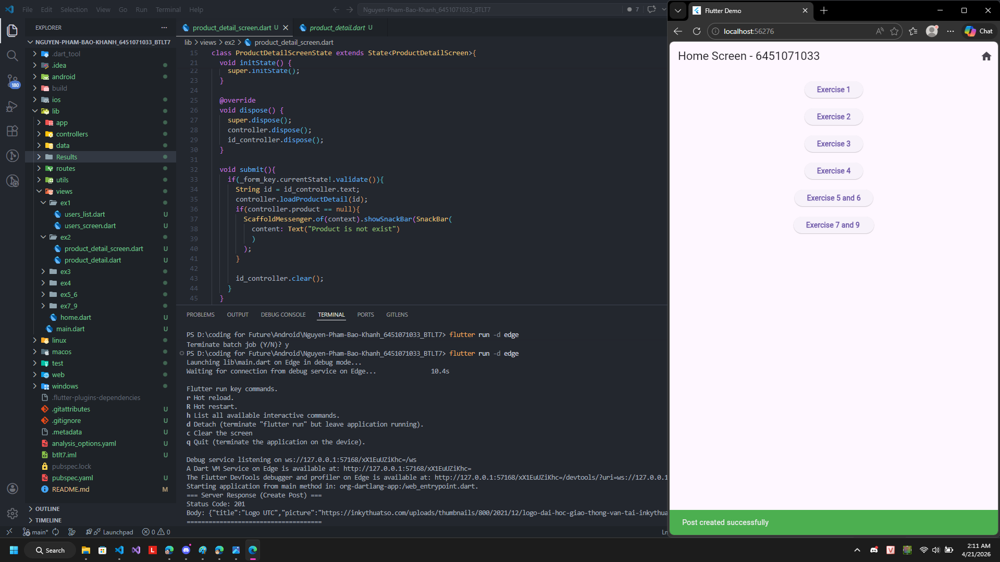 |

---

## Bài 4: Cập nhật hồ sơ (Profile Update)
Thay đổi thông tin cá nhân và kiểm tra sự thay đổi.

| Trước khi cập nhật | Sau khi cập nhật |
|:---:|:---:|
| 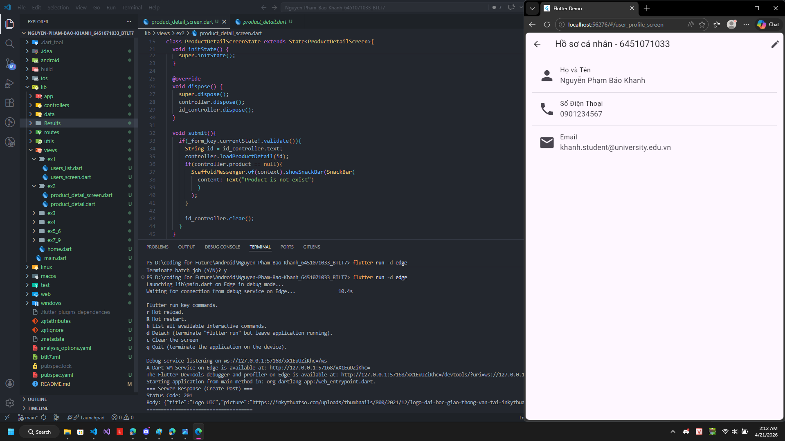 | 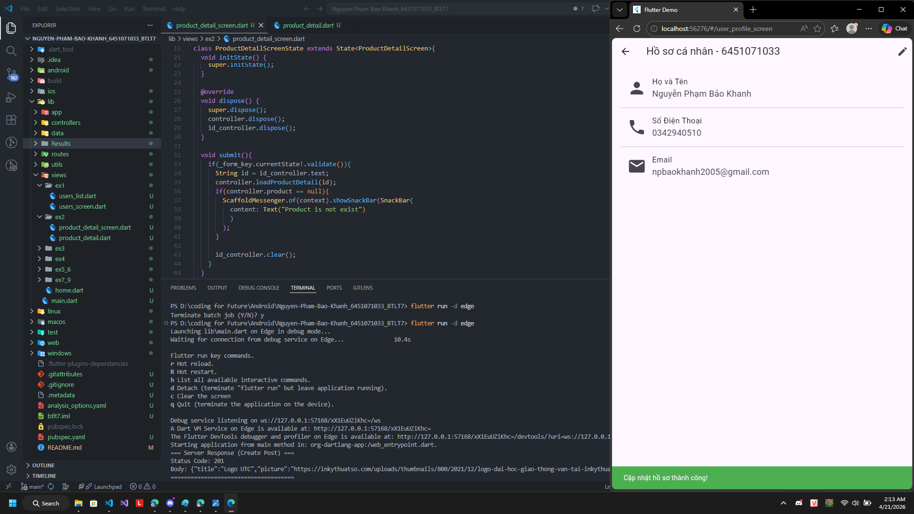 |

---

## Bài 5: Quản lý nhiệm vụ (Task Management)
Giao diện quản lý danh sách công việc, cửa sổ đối thoại và trạng thái sau khi xóa.

| Màn hình nhiệm vụ | Cửa sổ đối thoại | Đã xóa nhiệm vụ |
|:---:|:---:|:---:|
| 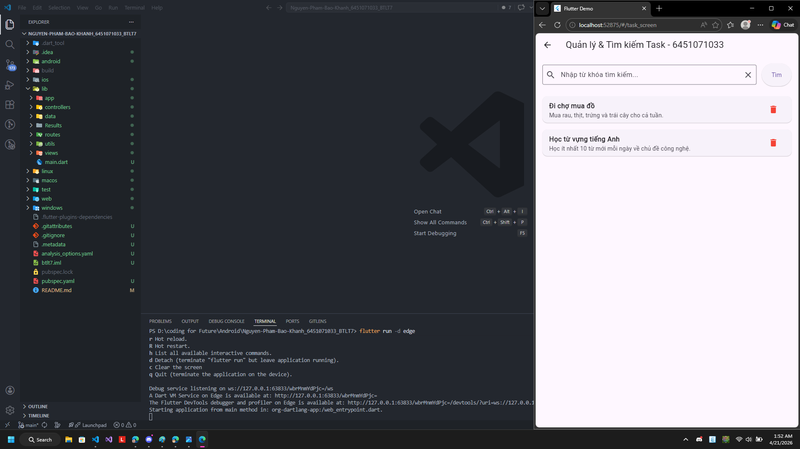 | 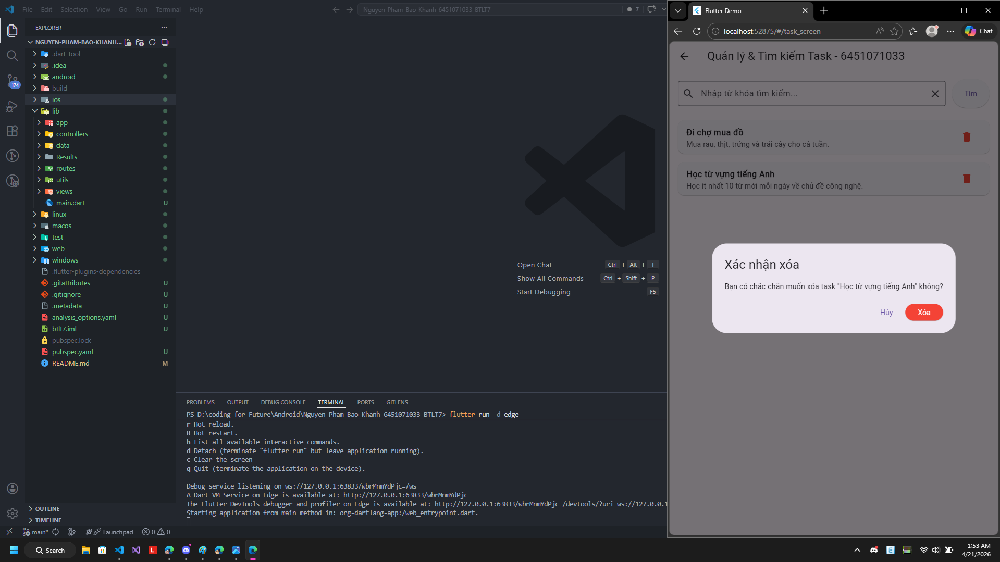 | 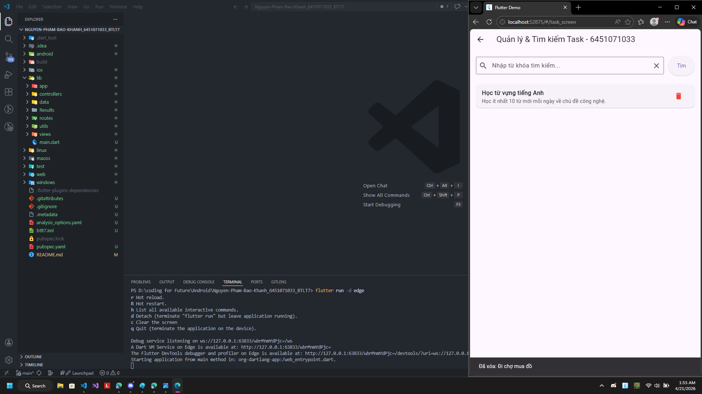 |

---

## Bài 6: Tìm kiếm nhiệm vụ (Task Search)
Tính năng tìm kiếm nhiệm vụ trong danh sách.
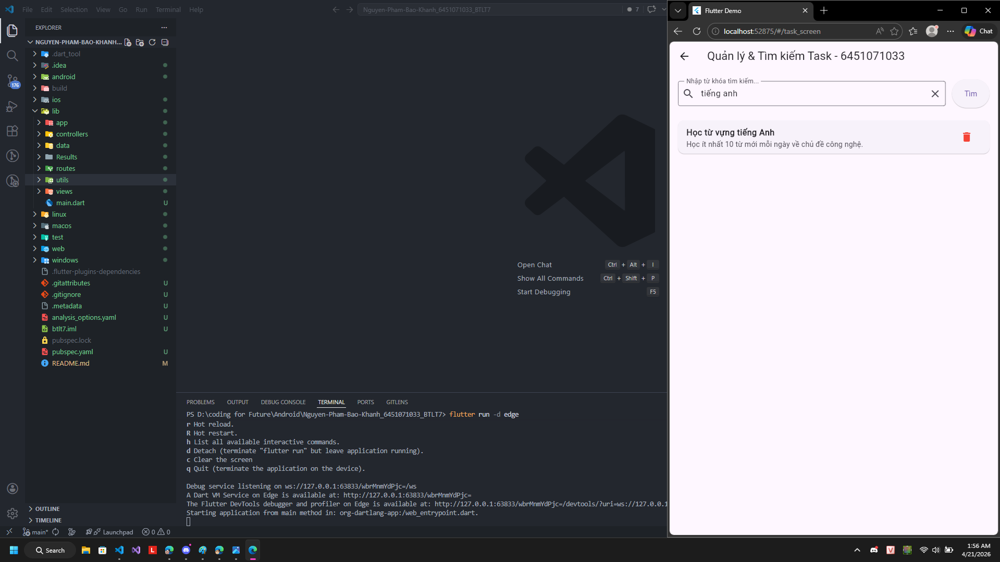

---

## Bài 7, 9: Các tính năng khác
Tổng hợp các màn hình và chức năng bổ trợ khác.
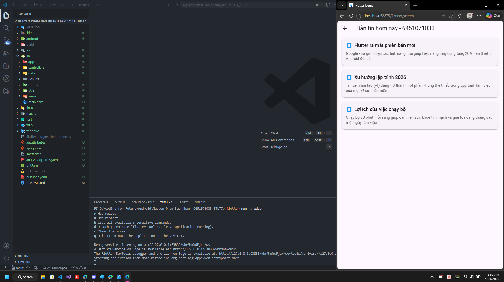

---
*Cảm ơn thầy đã xem!*
